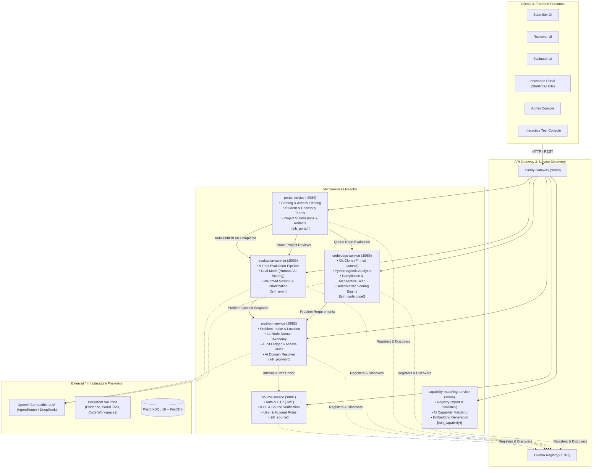

<div align="center">

# 🚀 SIH PS26043 — SAAMYUKT
### **Crowdsourced Societal Challenge & Collaborative Innovation Platform**

**Smart India Hackathon (SIH)** · **Problem Statement ID:** `PS26043`  
**Organization / Ministry:** Government of Jharkhand  
**Category:** Software | **Theme:** Smart Education & Societal Problem Solving  
**Team:** **FerraBits**

---

[](https://openjdk.org/)
[](https://spring.io/projects/spring-boot)
[](https://spring.io/projects/spring-cloud)
[](https://www.postgresql.org/)
[](https://www.docker.com/)
[](https://github.com/Netflix/eureka)
[](https://caddyserver.com/)

</div>

---

## 📌 Executive Summary

Modern governance and academic ecosystems face a critical disconnect: grassroots societal challenges experienced by citizens, local self-governments (Panchayati Raj Institutions, Urban Local Bodies), grassroots communities (Self Help Groups, NGOs), and industry often lack structured channels to reach universities and researchers capable of solving them.

**SAAMYUKT**, engineered by **Team FerraBits** for **SIH PS26043**, is an enterprise-grade, distributed microservices platform designed to crowdsource, verify, evaluate, prioritize, and collaboratively solve real-world societal challenges. It introduces a closed-loop innovation lifecycle:
1. **Grassroots Problem Crowdsourcing** across 5 distinct source buckets with KYC and field verification.
2. **AI-Assisted Domain Taxonomy Classification** mapping problems across a 44-node 3-tier ontology.
3. **Multi-Perspective 5-Pool Evaluation Engine** (Government, Industry, HEI, Citizen, Community) combining human domain experts with autonomous AI evaluators.
4. **Targeted Access Control & Distribution** to academic institutions and student innovators.
5. **Student & University Collaborative Portal** with team formation and solution submission.
6. **CodeJudge Automated Evaluation Engine** running static code analysis, agentic legibility scans, requirement compliance matching, and deterministic scoring on pinned git commits.
7. **Batch 3 Capability Matching & Registry** managing institutions, skills, and equipment for intelligent matching.

---

## 🏗️ System Architecture

SAAMYUKT adopts a **Database-per-Service Microservices Architecture** with no monolithic coupling, no shared databases, and no cross-service foreign keys. Inter-service communication occurs via lightweight REST JSON contracts discovered dynamically via **Spring Cloud Netflix Eureka**. The public surface is unified under a high-performance **Caddy L7 Reverse Proxy Gateway**.



---

## 🧩 Microservice Breakdown

| Service | Port | Database | Primary Responsibilities |
|---|---|---|---|
| **`gateway`** | `8080` | — | Caddy 2 reverse proxy; routes external paths (`/auth`, `/problems`, `/evaluation`, `/portal`, `/codejudge`) to internal upstream services. |
| **`eureka-server`** | `8761` | — | Netflix Eureka service discovery engine; enables client-side load balancing and resilient service-to-service communication. |
| **`source-service`** | `8081` | `sih_source` | User registration, Phone OTP authentication, claim-based JWT issuance, KYC verification, entity accounts (Government, Industry, HEI, Community, Citizen). |
| **`problem-service`** | `8082` | `sih_problem` | Problem intake, GIS coordinates & addresses, domain taxonomy (12 root / 26 level-2 / 6 level-3 nodes), append-only audit trail, access rule resolution. |
| **`evaluation-service`** | `8083` | `sih_eval` | Phase-2 evaluation pipeline across 5 pools (Government, Industry, HEI, Citizen, Community), autonomous AI scoring fallback, weighted 0–100 aggregation, priority banding. |
| **`portal-service`** | `8084` | `sih_portal` | Published problem discovery, participant registration (Student vs University), team formation, project submissions, artifact storage, evaluator review feedback loop. |
| **`codejudge-service`** | `8085` | `sih_codejudge` | Commit-pinned git clone, Python agentic-legibility analyzer, software architecture check, requirement compliance matching, and deterministic scoring. |
| **`capability-matching-service`** | `8086` | `sih_capability` | Batch 3 capability matching and registry operations, AI embedding generation, sparse/dense retrieval, and team synthesis matching. |
| **`saamyukt-common`** | — | — | Shared Maven kernel module containing cross-service Enums, shared DTOs, and exception models. |
| **`saamyukt-security`** | — | — | Shared stateless security library containing `JwtService`, `JwtAuthFilter`, and claim-based `AuthUser`. |

---

## 👥 Persona & Multi-Entity Model

The platform accommodates a diverse set of real-world societal stakeholders divided into **5 Source Buckets** and **10+ Sub-Entities**:

```
                                  Source Buckets
                                         │
        ┌─────────────┬──────────────────┼─────────────────┬─────────────┐
        ▼             ▼                  ▼                 ▼             ▼
   GOVERNMENT      INDUSTRY             HEI            COMMUNITY      CITIZEN
  • Depts         • Corporates / MSME   • Universities  • NGOs / SHGs  • Individuals
  • ULBs (Cities) • Startups            • Colleges      • RWAs         • Groups
  • PRIs (Villages)• Labs / R&D         • Research Labs • Foundations
```

### Supported Platform Personas:
1. **Submitter (`SUBMITTER`)**: Submits verified challenges, attaches field evidence (photos, documents, surveys), and tracks progress.
2. **Reviewer (`REVIEWER`)**: Validates entity documentation, field legitimacy, and verifies whether the problem is genuine before onboarding.
3. **Evaluator (`EVALUATOR`)**: Domain experts assigned to pools (Govt, Industry, HEI, Citizen, Community) to score criteria and review student project solutions.
4. **Admin (`ADMIN`)**: Platform governance, system health monitoring, pool configuration, and access overrides.
5. **Participant (Student / University)**: Browses published problems in the Innovation Portal, forms teams, links GitHub repositories, and uploads technical deliverables.

---

## 🔄 End-to-End Workflow Lifecycles

### 1. Problem Submission & Validation
```
Submitter Auth (OTP) ──► Verify Source Account ──► POST /problems (Title, Geospatial, Evidence)
                                                             │
Audit Entry Logged ◄── Optimistic Locking ◄── AI Domain Taxonomy Resolution
                                                             │
                                              Status: PENDING_VERIFICATION ──► REGISTERED
```

### 2. Multi-Pool Evaluation & Prioritization
```
 REGISTERED Problem
        │
        ▼
   POST /evaluation/cycles/{id}/analyze
        │
        ├──► Government Pool Scorecard  (Human or AI AUTO)
        ├──► Industry Pool Scorecard    (Human or AI AUTO)
        ├──► HEI / Academia Scorecard   (Human or AI AUTO)
        ├──► Citizen Perspective Score  (Human or AI AUTO)
        └──► Community Impact Score     (Human or AI AUTO)
        │
        ▼
   Weighted Score Aggregation (0 - 100) & Priority Banding (CRITICAL / HIGH / MEDIUM / LOW)
        │
        ▼
   Auto-Publish to Portal (EVALUATION_COMPLETED ──► PUBLISHED)
```

### 3. Audience & Access Rules
Each problem statement enforces granular visibility rules:
- `OPEN_TO_ALL`: Visible to all authenticated universities and student participants.
- `UNIVERSITY_ONLY`: Visible exclusively to verified HEI participants.
- `SELECTED_UNIVERSITIES`: Restricts access to specifically named universities.
- `AUTO_SELECTED_UNIVERSITIES`: Uses an LLM to derive matching university specializations based on the problem's domain taxonomy; fails closed if unresolved.

### 4. Student Innovation & CodeJudge Automated Assessment
```
Student/Team ──► Browse Accessible Problems ──► Create DRAFT Submission
                                                         │
Submit Solution ◄── Attach GitHub URL (Fixed Commit) + Deliverables + Documents
        │
        ├──► Pushed to Problem's Human Evaluator (ACCEPT / RETURN review cycle)
        │
        └──► Best-Effort Push to CodeJudge Engine (:8085)
                 │
                 ├── 1. Clone repository at pinned commit
                 ├── 2. Run Python Agentic Legibility & Static Analyzer
                 ├── 3. Architecture, code quality, and security assessment
                 ├── 4. Requirements & Problem Statement matching
                 └── 5. Produce deterministic score & evidence report
```

---

## 🛠️ Technology Stack

| Layer | Technology | Details |
|---|---|---|
| **Core Runtime** | Java 21 LTS | High-performance modern virtual threads and pattern matching |
| **Framework** | Spring Boot 4.1.1 | Reactive and REST microservices reactor |
| **Cloud & Discovery** | Spring Cloud 2025.1.3 | Spring Cloud Netflix Eureka discovery & HTTP Exchange clients |
| **Database** | PostgreSQL 16 + PostGIS 3.4 | Relational models with spatial indexing for geo-located problems |
| **Migration** | Flyway | Zero-downtime versioned schema migrations per microservice |
| **Gateway** | Caddy 2 | Production-ready HTTP/2 reverse proxy with automatic compression |
| **Security** | Stateless JWT (HMAC-SHA256) | Claim-based identity, encrypted tokens, 5-minute OTP TTL |
| **Automated Testing** | Python 3 + AST Analyzer | Agentic code legibility, dependency audit, and static analysis |
| **AI Integration** | OpenAI-Compatible API | DeepSeek-V4 / AgentRouter integration with deterministic fallback |
| **DevOps & Containers** | Docker & Docker Compose | Multi-container orchestrated network with health checks |

---

## 🚀 Quick Start Guide

### Prerequisites
- **Java Development Kit (JDK):** Version 21 or later
- **Maven:** 3.9+ (or use the included `./mvnw` wrapper)
- **Docker & Docker Compose:** Docker Engine 24+
- **Git**

---

### Step 1: Clone the Repository
```bash
git clone https://github.com/HarshVerma5840/PS26043-FerraBits.git
cd PS26043-FerraBits
```

### Step 2: Configure Environment Variables
Copy `.env.example` to `.env`:
```bash
cp .env.example .env
```
*(Optional)* Add your OpenAI-compatible API key in `.env` if you wish to enable live LLM evaluation:
```env
OPENAI_API_KEY=your-api-key-here
OPENAI_BASE_URL=http://host.docker.internal:20128/v1
OPENAI_MODEL=agentrouter/deepseek-v4-flash
```
> **Note:** If no API key is provided, the platform automatically and safely falls back to its deterministic heuristic evaluation engine without crashing.

### Step 3: Package Service JARs
Build all microservices using Maven:
```bash
# On Linux / macOS
./mvnw clean package -DskipTests

# On Windows (PowerShell)
.\mvnw.cmd clean package -DskipTests
```

### Step 4: Launch via Docker Compose
Start the complete microservices stack:
```bash
docker compose up -d --build
```

Verify that all containers are healthy:
```bash
docker compose ps
```

---

## 🌐 Endpoints & Service Access Points

| Component | URL | Description |
|---|---|---|
| **Gateway (Unified Entry)** | `http://localhost:8080` | Reverse proxy for all microservices |
| **Eureka Registry Dashboard** | `http://localhost:8761` | Live microservice health & instance registry |
| **Test & Validation Console** | `file:///.../test-ui/index.html` | Interactive frontend for judges and API verification |
| **Actor UI Portals** | `file:///.../actor-ui/*.html` | Dedicated dashboards for Submitter, Reviewer, Evaluator, Portal, and Admin |
| **Registration Wizard** | `file:///.../registration-wizard/index.html` | Dynamic multi-entity registration wizard |
| **PostgreSQL Database** | `localhost:5432` | Credentials: `sih` / `sih` |

---

## 🧪 Testing & Demo Walkthrough

An interactive **Test Console** is included under `/test-ui/index.html` allowing one-click testing of complete SIH scenarios:

### 1. Authentication
1. Open `test-ui/index.html` in your browser.
2. Under the **Auth** tab, request an OTP for any 10-digit mobile number (e.g. `9876543210`).
3. Enter the mock code `123456` (configured via `MOCK_OTP_CODE`) and click **Verify OTP**.
4. The JWT access token is automatically saved and attached to subsequent calls.

### 2. Role Escalation for Demoing
To promote a user to `ADMIN`, `REVIEWER`, or `EVALUATOR`, run the following in your terminal:
```bash
docker exec -it sih26043-pg psql -U sih -d sih_source -c "UPDATE users SET role='ADMIN' WHERE phone='9876543210';"
```

### 3. Submitting a Problem Statement
1. Complete entity registration or link a pre-verified source account.
2. Submit a problem via `POST /problems` with title, description, GPS location, urgency, and domain taxonomy tags.
3. Advance problem lifecycle via `PATCH /problems/{id}/status` to `REGISTERED`.

### 4. Running 5-Pool Evaluation & Publishing
1. Navigate to `evaluation-service` or the Evaluator UI (`actor-ui/evaluator.html`).
2. Trigger cycle analysis: `POST /evaluation/cycles/{id}/analyze`.
3. When pools are configured to `AUTO`, AI scorecards are submitted immediately, folding scores into a composite rating and auto-publishing the problem to the Innovation Portal!

### 5. Student Submission & CodeJudge Evaluation
1. Switch persona to a Student participant in `actor-ui/portal.html`.
2. Browse the published catalog and create a submission with your GitHub repository URL and commit hash.
3. Trigger automated code assessment via `POST /internal/codejudge/evaluations` to observe commit-pinned cloning, static analysis, and deterministic scoring.

---

## 📂 Repository Directory Layout

```
PS26043-FerraBits/
├── pom.xml                        # Root Maven parent POM (Spring Boot 4.1.1, Java 21)
├── docker-compose.yml             # Complete container orchestration definition
├── Dockerfile.service             # Standard thin JRE container for Spring Boot services
├── Dockerfile.codejudge           # Specialized container with Git + Python3 AST analyzer
│
├── saamyukt-common/                  # Shared domain enums, exceptions, and DTO contracts
├── saamyukt-security/                # Stateless JWT authentication & security filters
├── eureka-server/                 # Spring Cloud Netflix Eureka service registry (:8761)
│
├── source-service/                # Auth, KYC, and multi-bucket source account management (:8081)
├── problem-service/               # Problem aggregate, 44-node domain taxonomy, audit trail (:8082)
├── evaluation-service/            # 5-pool evaluation pipeline, scoring, priority banding (:8083)
├── portal-service/                # Student & University innovation portal & submissions (:8084)
├── codejudge-service/             # Automated git clone, agentic code analysis, scoring (:8085)
├── capability-matching-service/   # Batch 3 Capability matching and registry operations (:8086)
├── gateway/                       # Caddy 2 L7 reverse proxy configuration (:8080)
│
├── actor-ui/                      # Role-specific frontend portals (Submitter, Reviewer, etc.)
├── registration-wizard/           # Dynamic onboarding wizard for 10+ entity types
├── test-ui/                       # Interactive testing console for SIH evaluation
│
├── evaluator-workflow.drawio.xml  # Visual architectural workflows & sequence diagrams
├── reviewer-workflow.drawio.xml
├── student-workflow.drawio.xml
├── submitter-workflow.drawio.xml
└── university-workflow.drawio.xml
```

---

## 👥 Team FerraBits

*Developed with passion for Smart India Hackathon (SIH).*

| Role | Details |
|---|---|
| **Team Name** | **FerraBits** |
| **Problem Statement** | **PS26043 (SIH26043)** |
| **Organization** | Government of Jharkhand |
| **Project Name** | **SAAMYUKT** |

---

<div align="center">
  <b>Built for Impact. Scalable for the Nation. 🇮🇳</b>
</div>
